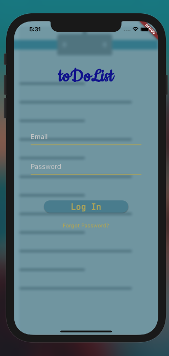
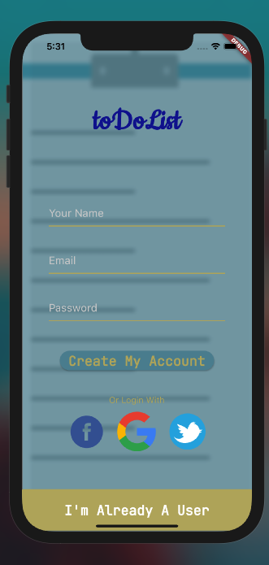

# toDoList

A new Flutter project.

## Getting Started

After learning the basics of flutter with firebase as backend , I' m  
on may to build "toDoList" in which users can store their notes with full assurance of securioty as it includes Authorisation (login/sigup) at the first place. Lets see how many weeks will take me to develop what's in my mind right now. Peace !

## So far :

### UI for Sign In & Sign Up is Done

# SIGN IN

# SIGN UP

